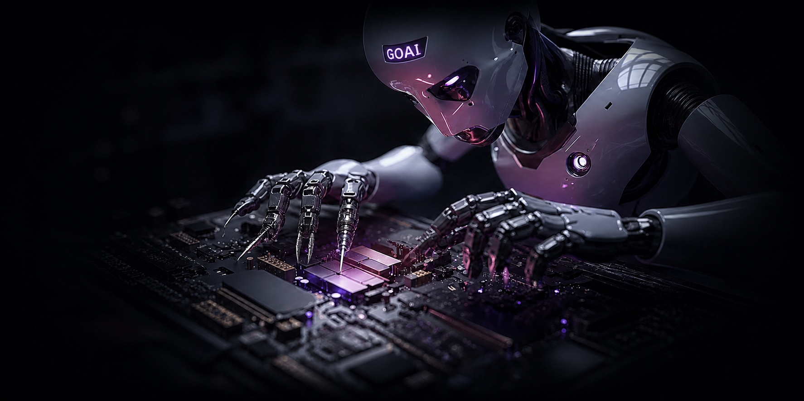
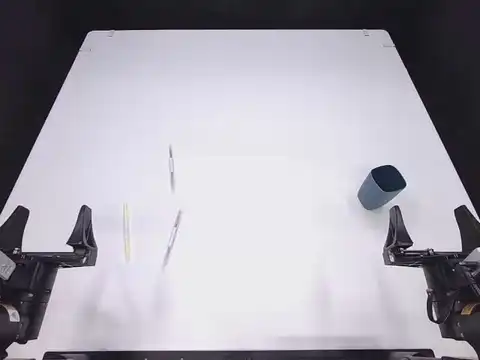
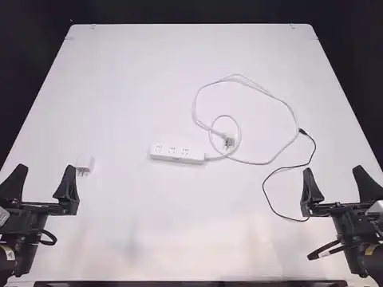
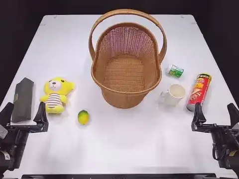
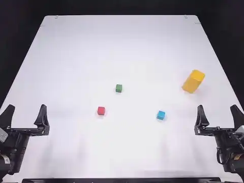
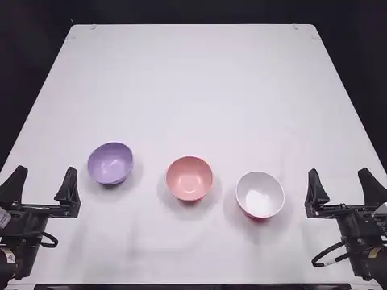
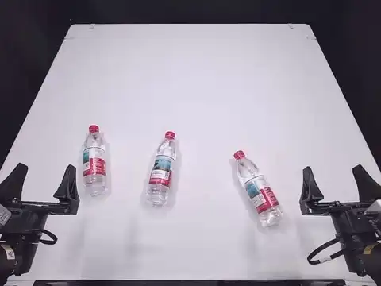

# GOAI 2026 多任务双臂开源 VLA



📖 [完整复现指南](REPRODUCE.md) · [训练与真机前选模计划](TRAINING_AND_MODEL_SELECTION_PLAN.md)

本项目以 **LingBot-VLA 2.0** 为主体模型，目标是在 GOAI 2026 决赛六项真实机器人任务中，让双 PIPER X 具备视觉理解、语言指令理解、空间推理、未来状态预测与双臂协同操作能力，获得较高的任务成功率和比赛得分，并对物体位置、初始状态及环境变化具备良好的泛化能力。

## 1. 项目概览

| 项目 | 当前方案 |
|---|---|
| 机器人 | 双 PIPER X：12 维机械臂关节 + 2 维夹爪 |
| 比赛任务 | 6 个真实机器人任务 |
| 演示数据 | 600 episodes，666,002 frames，25 FPS |
| 数据划分 | Train / Validation / Test = 510 / 60 / 30 |
| 主模型 | LingBot-VLA 2.0 6B |
| 视觉语言骨干 | Qwen3-VL-4B-Instruct |
| 动作生成 | 36 层稀疏动作 MoE，32 experts，Top-4 |
| 视觉输入 | 顶部、左腕、右腕三路相机 |
| 动作窗口 | 未来 50 steps |
| 当前策略 | 冻结 VLM 与教师，训练动作 MoE、投影层和对齐头 |

### 项目目录结构

```text
Final_GOAI/
├── assets/
│   ├── goai-dual-arm-hero.png              # README 项目横幅
│   ├── norm_stats/
│   │   └── goai_piper_x.json               # 仅由 510 个训练 episodes 计算的归一化统计
│   ├── task_demos/                          # 六项真机任务的 20 秒动画展示
│   └── training_data/
│       └── goai_piper_x_six_tasks.example.txt
├── configs/
│   ├── goai_piper_x.yaml                    # 双 PIPER 关节、夹爪与三相机映射
│   └── train_expert_only.yaml               # LingBot-VLA 2.0 第一阶段训练配置
├── patches/
│   └── lingbot-vla-v2/
│       └── episode_split_loader.patch       # 训练加载器严格限制到指定 episodes
├── scripts/
│   └── data/
│       ├── convert_real_hdf5_to_lerobot_v30_joint.py
│       ├── create_lerobot_episode_splits.py
│       └── validate_lerobot_v30_joint.py
├── splits/
│   ├── episode_splits_seed2026.json         # 完整、可审计的固定划分清单
│   ├── train_episodes.txt                    # 510 episodes
│   ├── val_episodes.txt                      # 60 episodes
│   ├── test_episodes.txt                     # 30 episodes
│   └── SHA256SUMS                            # 划分文件完整性校验
├── .gitignore                                # 排除数据、权重、检查点、日志与缓存
├── README.md                                 # 项目总览
└── REPRODUCE.md                              # 从数据转换到训练的完整复现指南
```

仓库只保存团队原创代码、配置、固定划分和复现文档；原始数据、基础模型权重与训练检查点通过官方来源下载，不直接提交到 Git。

## 2. 技术路线

```text
GOAI 600 条 HDF5 真实演示
          │
          ▼
LeRobot v3 转换 → 质量检查 → 固定 Train/Val/Test
          │
          ▼
双 PIPER 14 维状态/动作 → LingBot 55 维统一表示
          │
          ▼
LingBot-VLA 2.0 预训练模型
  ├─ Qwen3-VL：视觉与语言理解
  ├─ MoGe / MoRGBD：深度与三维几何监督
  ├─ DINO Video：未来视觉状态监督
  └─ Sparse MoE + Flow Matching：连续动作生成
          │
          ▼
Expert-only 后训练 → 离线评估 → 安全回放 → 双 PIPER 实机
```

第一阶段优先让模型学会“**双 PIPER 应该怎样动**”。在数据和实机评测证明收益后，才考虑短程全参数 post-training，让视觉语言骨干进一步适应比赛场景。

### 2.1 后训练输入与动作目标

每个训练样本由语言指令、顶部相机、左右腕部相机、当前机器人状态和未来动作窗口组成。原始 14 维状态/动作按 Robot Config 映射到 LingBot 55 维统一空间：

- 双臂 12 维关节使用 `joint_delta`，学习相对当前状态的下一步变化；
- 双夹爪 2 维使用绝对目标，避免开合量被重复积分；
- 未使用的末端位姿、腰、头、底盘和灵巧手槽位通过 mask 排除；
- 每个样本预测未来 50 steps，使用 Flow Matching 从噪声轨迹生成连续 action chunk；
- 训练加载器只读取固定的 510 个训练 episodes，归一化统计也只来自训练集。

### 2.2 Expert-only 后训练细节

| 组件 | 训练状态 | 作用 |
|---|---|---|
| Qwen3-VL 视觉语言骨干 | 冻结 | 保留预训练视觉语义与指令理解能力 |
| MoGe / MoRGBD / DINO Video | 冻结 | 仅生成空间、深度和未来视觉监督目标 |
| 36 层动作 MoE | 训练 | 学习六任务的双臂动作分布与专家路由 |
| 状态/动作投影层 | 训练 | 对接双 PIPER 状态与 55 维统一表示 |
| 当前/未来深度和视频对齐头 | 训练 | 把 VLA 特征对齐到教师特征空间 |

总损失由动作生成主损失和辅助感知损失共同组成：

```text
L_total = L_flow_action
        + 0.004 × L_depth
        + 0.004 × L_future_depth
        + 0.004 × L_future_video
        + 0.001 × L_sequence
        + 0.0001 × L_router_z
        + patch / cosine alignment losses
```

其中动作 Flow Matching 是主目标；深度、未来深度和 DINO Video 约束模型理解当前几何与未来状态变化；sequence-wise loss 和 router z-loss 用于稳定稀疏 MoE 路由。教师网络不更新参数，也不在最终机器人推理端运行。

推荐使用 Muon、`lr=1e-5`、5% warmup、混合精度、梯度检查点和 `torch.compile`。当前目标为 10,000 optimizer steps、`global_batch_size=8`。为支持选模，每 1,000 steps 保存并验证一次，而不是等待完整 epoch。

### 2.3 评估方式

评估分为训练健康、离线六任务验证和双 PIPER 真机三层：

1. **训练健康**：检查 NaN/Inf、总 loss、动作 loss、辅助 loss、梯度范数、显存、吞吐量、MoE 路由熵和专家使用率；出现专家塌缩、动作越界或 loss 突跳的检查点直接淘汰。
2. **离线验证**：只使用 60 条 validation episodes，分别计算六任务 action MAE/RMSE、50-step 轨迹 ADE/FDE、夹爪开闭正确率、速度/加速度/jerk、动作越界率、辅助教师 loss 和推理延迟。
3. **候选排序**：综合分数采用“50% 六任务平均分 + 30% 最差任务分 + 10% 动作平滑性 + 10% 路由与推理稳定性”，避免平均成绩掩盖单项任务失效。
4. **冻结测试**：离线 Top-3 确定后，测试集只运行一次，不允许根据 30 条 test episodes 继续调参。
5. **真机筛选**：Top-3 先做动作反归一化、关节限位和低速空载回放，再直接进入双 PIPER；先每模型每任务 3 次初筛，再对 Top-2 每模型每任务至少 5 次正式测试。

真机最终记录六任务成功率、最差任务成功率、完成时间、人工急停、碰撞/越界、动作平滑性和推理延迟。最终模型按安全性和六任务稳定成功率选择，不按最低训练 loss 单独决定。

## 3. LingBot-VLA 2.0 核心优势与能力

LingBot-VLA 2.0 不是简单的“看图后回归关节值”，而是把语言、视觉、机器人状态、空间结构和未来动态联合用于动作生成。以下模型特性依据 [LingBot-VLA 2.0 官方项目](https://github.com/Robbyant/lingbot-vla-v2)。

| 核心能力 | 技术含义 | 对本项目的价值 |
|---|---|---|
| 约 60,000 小时跨本体预训练 | 约 50,000 小时、20 种机器人配置的轨迹，加约 10,000 小时第一视角人类视频 | 从通用操作知识出发，不用靠 600 条演示从零训练 |
| 统一 55 维表示 | 统一表示机械臂、末端、夹爪、灵巧手、腰、头和移动底盘 | 双 PIPER 只激活所需槽位，同时复用跨机器人知识 |
| 稀疏动作 MoE | 36 层、32 experts、Top-4 路由，并包含共享专家 | 以可控激活计算量学习不同任务、阶段与动作模式 |
| 双查询蒸馏 | 当前感知查询与未来感知查询接受教师监督 | 同时理解“现在在哪里”和“动作后会怎样变化” |
| 预测式世界动态 | 预测未来深度和视频表征作为辅助目标 | 强化双臂配合、抓取状态判断和长时序操作 |
| Flow Matching | 从噪声轨迹逐步生成连续动作分布 | 能表达多种合理操作轨迹，不局限于单一均值动作 |
| 50-step Action Chunk | 单次输出连续动作窗口 | 提高短时动作连贯性，降低闭环推理频率 |
| 多视角融合 | 联合顶部与左右腕部相机 | 同时掌握全局布局和双手局部接触细节 |

### 3.1 统一 55 维动作/状态表示

| 槽位 | 维度 | 内容 |
|---|---:|---|
| Arm Joint | 14 | 左右机械臂关节 |
| End-effector Pose | 14 | 双侧末端位姿 |
| Gripper | 2 | 左右夹爪 |
| Dexterous Hand | 12 | 灵巧手关节 |
| Waist / Head / Base | 9 | 腰部、头部、移动底盘 |
| Reserved | 4 | 扩展槽位 |
| **合计** | **55** | 跨本体统一接口 |

本项目使用其中 **12 维双臂关节 + 2 维夹爪**。未使用槽位通过 mask 隔离，不进入训练损失。

### 3.2 空间、未来与动作联合学习

```text
语言指令 + 三路图像 + 机器人状态
             │
             ▼
          Qwen3-VL
     ┌───────┴────────┐
     ▼                ▼
当前空间查询       未来动态查询
MoGe / MoRGBD       DINO Video
     └───────┬────────┘
             ▼
 Sparse MoE + Flow Matching
             ▼
  双臂关节 + 双夹爪动作块
```

教师模型仅在训练时提供监督目标，不参与参数更新；部署时由训练后的 VLA 直接输出动作，不需要把全部教师模型放到机器人端。

### 3.3 为什么采用 Expert-only

510 条训练轨迹不足以安全支撑 6B 全参数长程训练。当前冻结 4.438B Qwen3-VL 参数与教师模型，训练约 1.938B 动作侧参数：

| 模块 | 参数量 | 状态 |
|---|---:|---|
| Qwen3-VL | 4.438B | 冻结 |
| 动作 MoE | 1.787B | 训练 |
| 深度/视频对齐模块 | 约 123M | 训练 |
| 其他动作侧模块 | 约 28M | 训练 |

这能保留预训练视觉语义，降低过拟合、灾难性遗忘和显存压力，同时集中学习双 PIPER 的动作分布。

## 4. 复现前置条件

### 4.1 硬件

推荐训练配置：

- Linux x86_64 服务器；
- NVIDIA RTX 6000D 84GB 单卡，或两张 32GB GPU 使用 FSDP2；
- CPU 25 核以上、内存 120GB 以上；
- 数据盘建议 300GB 以上；
- 双 PIPER X、顶部相机、左右腕部相机及对应控制主机用于部署。

最低配置不是固定承诺，取决于 micro batch、图像尺寸、FlashAttention、梯度检查点和分片策略。正式训练前必须通过单步 `forward + backward + optimizer.step` 显存测试。

### 4.2 软件

以下版本来自本项目已经完成导入、数据处理和训练单步验证的服务器环境，建议严格锁定：

| 软件 | 验证版本 | 说明 |
|---|---|---|
| 操作系统 | Ubuntu 22.04.5 LTS | Linux x86_64 |
| NVIDIA Driver | 595.71.05 | RTX 6000D 驱动；不得低于 PyTorch CUDA Runtime 的最低要求 |
| Python | 3.12.13 | 独立 Conda 环境 `lingbotvla-v2` |
| PyTorch | 2.8.0+cu128 | 使用 CUDA 12.8 构建；以 `torch.version.cuda` 为准 |
| TorchVision | 0.23.0+cu128 | 必须与 PyTorch 2.8.0 匹配 |
| TorchData | 0.11.0 | 数据管线依赖 |
| TorchCodec | 0.6.0 | 视频解码依赖 |
| Transformers | 4.57.3 | Qwen3-VL 与 LingBot-VLA 骨干 |
| Tokenizers | 0.22.2 | 与 Transformers 配套 |
| FlashAttention | 2.8.3 | 必须针对当前 PyTorch、CUDA 和 GPU 架构编译 |
| Triton | 3.4.0 | fused MoE 与编译算子依赖 |
| LeRobot | 0.4.2 | 本项目使用其 v3 数据格式与 episode 筛选接口 |
| Accelerate | 1.7.0 | 分布式与设备管理 |
| Safetensors | 0.5.3 | 权重加载 |
| NumPy | 1.26.4 | 不建议直接升级到 2.x，以免旧扩展 ABI 不兼容 |
| PyArrow | 21.0.0 | episode 元数据与 split 生成 |
| h5py | 3.14.0 | GOAI HDF5 原始数据读取 |
| OpenCV Headless | 4.11.0.86 | JPEG 解码与数据转换 |
| PyAV | 15.0.0 | LeRobot 视频读写后端 |
| Pillow | 11.3.0 | 图像与动画验证 |
| OmegaConf | 2.3.0 | 配置解析 |
| PyYAML | 6.0.2 | YAML 配置读取 |
| FFmpeg | 4.4.2 | 视频检查与 README 演示生成 |

推荐的核心安装顺序：

```bash
conda create -n lingbotvla-v2 python=3.12.13 -y
conda activate lingbotvla-v2

# 按 CUDA 12.8 安装 PyTorch 官方 wheel
pip install torch==2.8.0 torchvision==0.23.0 torchaudio==2.8.0 \
  --index-url https://download.pytorch.org/whl/cu128

pip install -r requirements.txt
pip install flash-attn==2.8.3 --no-build-isolation
pip install lerobot==0.4.2 accelerate==1.7.0
```

这里的“CUDA 12.8”指 PyTorch wheel 的编译 Runtime，不等同于驱动所显示的最高 CUDA 兼容版本。FlashAttention 和 fused MoE 属于本地 CUDA 扩展，换 GPU、PyTorch 或 CUDA 版本后必须重新编译并复测。

安装完成后执行：

```bash
python - <<'PY'
import torch, transformers, flash_attn, lerobot, triton
print("CUDA available:", torch.cuda.is_available())
print("PyTorch / CUDA:", torch.__version__, torch.version.cuda)
print("Transformers:", transformers.__version__)
print("FlashAttention:", flash_attn.__version__)
print("LeRobot / Triton:", lerobot.__version__, triton.__version__)
PY
```

只有在 CUDA 可用、五个核心库均可导入，并且 `forward + backward + optimizer.step` 单步测试通过后，才能启动正式训练。模型权重还需单独准备 LingBot-VLA 2.0、Qwen3-VL、MoGe/MoRGBD 和 DINO Video。

## 5. 数据集说明

决赛数据来源于 GOAI 官方真实机器人数据仓库：

- [ModelScope · GOAI-2026](https://modelscope.cn/datasets/RoboDojo-Benchmark/GOAI-2026/tree/master/data)
- [Hugging Face · data/real](https://huggingface.co/datasets/RoboDojo-Benchmark/GOAI-2026/tree/main/data/real)

转换后的训练数据：

- LeRobot v3.0，25 FPS；
- 600 episodes，666,002 frames；
- 每项任务 100 episodes，共六项任务；
- 顶部、左腕、右腕三路相机；
- 原始状态/动作 14 维；
- 动作使用 `joint_delta`；
- 每个样本预测未来 50 steps。

| Split | Episodes | 每任务 | 用途 |
|---|---:|---:|---|
| Train | 510 | 85 | 参数更新与归一化统计 |
| Validation | 60 | 10 | 调参与检查点选择 |
| Test | 30 | 5 | 最终冻结评估 |

三个集合使用固定随机种子且 episode 无重叠。训练加载器严格限制为 510 个训练 episodes，归一化统计也只允许使用训练集，避免数据泄漏。

## 6. 训练流程

### 6.1 推荐起始配置

```yaml
train:
  freeze_vision_encoder: true
  train_expert_only: true
  train_state_proj: true
  enable_gradient_checkpointing: true
  enable_mixed_precision: true
  use_compile: true
  optimizer: muon
  lr: 1.0e-5
  lr_warmup_ratio: 0.05
  micro_batch_size: 2
  gradient_accumulation_steps: 4
  global_batch_size: 8
```

### 6.2 执行顺序

1. 校验数据文件、split、Robot Config 与训练集归一化统计；
2. 校验所有基础权重与配置路径；
3. 执行单步正向、反向和优化器压力测试；
4. 运行 20–50 steps 冒烟训练；
5. 运行 1,000 steps 阶段检查；
6. 保存并评估 5,000 / 10,000 steps 候选检查点；
7. 按六项任务分别统计验证结果；
8. 依据离线与真机表现决定停止、续训或调整。

训练集展开后共有 568,610 个逐帧动作窗口：

```text
steps_per_epoch = floor(568610 / global_batch_size)
```

当 `global_batch_size = 8` 时，1 epoch = 71,076 steps；10,000 steps ≈ 0.141 epoch。项目以 step 和验证/真机表现选模，不机械追求完整 epoch 数。

训练过程中持续检查总 loss、VLA loss、辅助教师 loss、梯度范数、MoE 路由均衡、吞吐量、显存峰值和六任务采样均衡性。

## 7. 验证与部署流程

```text
训练检查点
   │
   ├─ 离线验证：六任务分项 loss、动作误差、轨迹可视化
   ├─ 冻结测试：仅对入选检查点运行一次测试集
   ├─ 安全回放：反归一化、关节限位、速度和动作连续性
   └─ 双 PIPER：低速空载 → Top-3 单任务初筛 → Top-2 六任务复测
```

部署前必须完成：

- 相机名称、顺序、分辨率和训练配置一致；
- 关节顺序、单位、零点、正负方向和夹爪范围一致；
- 状态归一化与动作反归一化使用同一份训练统计；
- `joint_delta` 正确转换为机器人控制指令；
- 设置关节限位、速度/加速度限制、急停和通信超时保护；
- 先低速、短动作窗口和人工急停监护，再提高执行速度。

## 8. 全部开源说明

本项目将以可复现为目标公开全部团队原创工程内容：

- 数据转换、质量检查与固定 split 脚本；
- 双 PIPER Robot Config 与 55 维映射；
- 仅训练集归一化统计及其生成脚本；
- LingBot-VLA 2.0 必要适配补丁；
- RTX 6000D / 双 32GB GPU 环境与训练配置；
- 训练、断点续训、评估、可视化和部署脚本；
- 六任务实验记录、复现步骤与已知问题。

受体积和第三方许可证约束，GOAI 官方数据与上游模型权重不重复上传到本仓库，而是提供官方来源、下载脚本、目录规范与校验信息。使用者仍需遵守 GOAI 数据集、LingBot-VLA、Qwen3-VL、MoGe、DINO 以及 PIPER SDK 各自许可证。

## 9. 上游项目

- [LingBot-VLA 2.0](https://github.com/Robbyant/lingbot-vla-v2)
- [RoboDojo Benchmark](https://github.com/RoboDojo-Benchmark/RoboDojo)
- [Piper X 官方产品页](https://www.agilex.ai/product/6979dfa6866efa631c991cff)

---

> 当前排名为 README 更新时的阶段性赛况，不代表最终比赛名次。

---

## 真机任务展示

六项 GOAI 双 PIPER 真实机器人任务。每段展示一个完整代表性 episode，并统一加速压缩至约 20 秒循环播放。

<table>
  <tr>
    <td width="33.33%" align="center"><b>01 · Fill the Pen Holder</b><br></td>
    <td width="33.33%" align="center"><b>02 · Insert the Charger</b><br></td>
    <td width="33.33%" align="center"><b>03 · Put Objects into the Basket</b><br></td>
  </tr>
  <tr>
    <td width="33.33%" align="center"><b>04 · Stack and Cover the Blocks</b><br></td>
    <td width="33.33%" align="center"><b>05 · Stack the Bowls</b><br></td>
    <td width="33.33%" align="center"><b>06 · Stand Up the Bottles</b><br></td>
  </tr>
</table>

> 展示素材来自 GOAI 官方真实机器人演示数据，顶部相机视角，统一为 480 × 360、10 FPS 动画预览。

